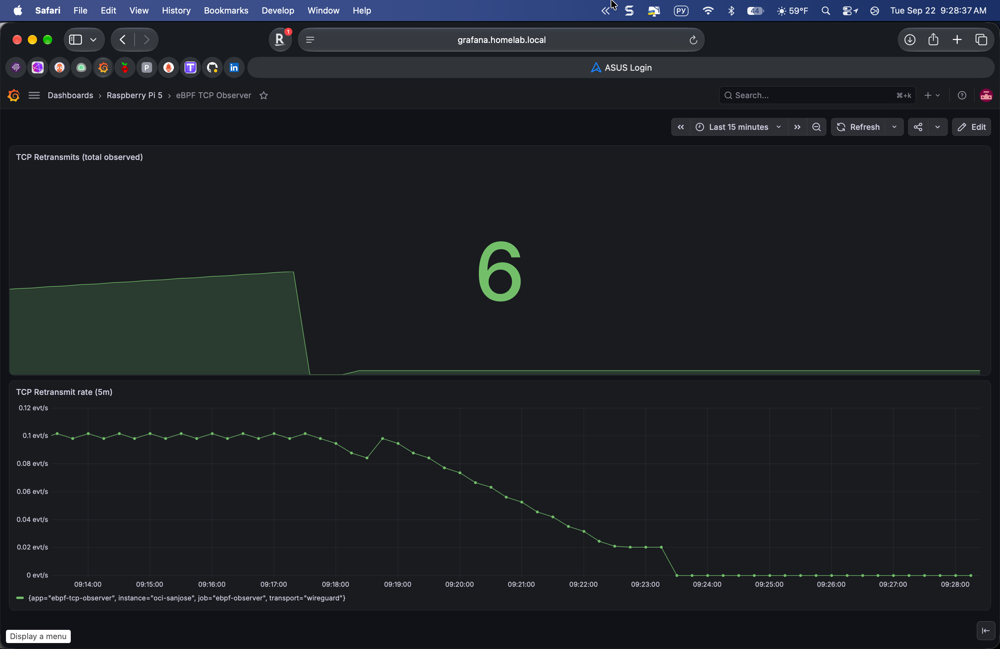

# ebpf-tcp-observer

An eBPF-based agent that observes kernel-level TCP events on a Linux host and
exports them as Prometheus metrics. Runs as a single Go binary using CO-RE
(Compile Once, Run Everywhere) via cilium/ebpf - no BCC, no runtime kernel
headers, no clang on the target host.

The reference deployment runs the agent on a public-facing arm64 VM (Oracle
Cloud Ampere A1) and streams metrics to a homelab Prometheus over a WireGuard
tunnel, so that TCP-level anomalies at the edge can be correlated with
existing service SLOs without exposing the scrape port to the internet.

## Table of contents

- [Architecture](#architecture)
- [Quickstart](#quickstart)
- [Metrics](#metrics)
- [Security posture](#security-posture)
- [Repository layout](#repository-layout)
- [Design decisions](#design-decisions)
- [Roadmap](#roadmap)
- [License](#license)

## Architecture

Data path: kernel tcp_retransmit_skb() -> eBPF kprobe -> shared
BPF_MAP_TYPE_ARRAY -> Go userspace polls the map every 1s -> Prometheus
counter delta -> HTTP /metrics bound to the WireGuard interface -> homelab
Prometheus scrape over the tunnel -> TSDB -> Grafana.

No scrape port is exposed on the public internet. The Oracle Cloud
security list allows only SSH/22, WireGuard/51820 udp, and ICMP; the host
nftables INPUT chain restricts port 9100 to traffic that arrived on wg0.

## Quickstart

Assumes a Linux host with kernel 5.15+, BTF enabled (/sys/kernel/btf/vmlinux
present), and Go 1.25+ to build.

### Build

Cross-compile from macOS to a Linux arm64 host:

    GOOS=linux GOARCH=arm64 CGO_ENABLED=0 \
        go build -ldflags="-s -w" -o bin/ebpf-observer-linux-arm64 ./cmd/observer

No clang is needed to build the Go binary. bpf2go-generated Go source carries
the compiled BPF object embedded as a byte slice. Re-generating the BPF
requires clang and lives behind: go generate ./internal/collector/

### Run

With the eBPF collector (needs CAP_BPF + CAP_PERFMON):

    ./bin/ebpf-observer -listen 10.0.0.4:9100 -collector ebpf -poll-interval 1s

Fall back to the synthetic stub if eBPF is unavailable (kernel too old,
missing caps, kprobe not exported):

    ./bin/ebpf-observer -listen 127.0.0.1:9100 -collector stub -stub-interval 10s

### Deploy as a systemd unit

See deploy/systemd/ebpf-observer.service for a hardened unit with ambient
BPF capabilities and filesystem confinement.

### Wire into Prometheus

See deploy/prometheus/scrape-job.alloy for a Grafana Alloy snippet, or add
to a classic prometheus.yml a job pointing at 10.0.0.4:9100 with 15s scrape
interval and labels app/instance/transport.

## Metrics

- ebpf_tcp_retransmits_total (Counter): TCP retransmit events observed via
  a kprobe on tcp_retransmit_skb. Increments per RTO fire, dup-ACK trigger,
  tail loss probe.

Standard Go runtime and process metrics are not exported. The agent uses a
dedicated prometheus.Registry to keep /metrics output focused on
eBPF-derived signals; add explicit collectors if you need runtime data.

Two counter semantics are bridged: the BPF map holds the absolute number of
events since program load, while ebpf_tcp_retransmits_total is a Prometheus
counter that only accepts non-negative Add(delta). The Go collector
remembers the last observed absolute value and adds the difference each
poll, resetting the baseline if the map goes backwards.

## Security posture

1. No public scrape port. The /metrics HTTP listener binds to the WireGuard
   interface address (10.0.0.4:9100), not 0.0.0.0. Prometheus pulls over
   the tunnel.
2. Cloud provider firewall closed. Oracle Cloud security list allows only
   SSH/22, WireGuard/51820 udp, and ICMP inbound. Port 9100 is not in
   the list.
3. Host firewall enforces WireGuard. An nftables rule accepts TCP dport
   9100 only when iifname == "wg0".
4. Tunnel direction. The homelab (Prometheus) initiates the WireGuard
   handshake and holds the peer with PersistentKeepalive; the edge VM
   never dials into the home network. No inbound port is exposed on the
   home router.
5. Least-privilege capabilities. The systemd unit grants only CAP_BPF,
   CAP_PERFMON, CAP_NET_ADMIN as ambient caps. Filesystem is confined by
   ProtectSystem=strict, ProtectHome, PrivateTmp.
6. fail2ban + unattended-upgrades on the host provide baseline SSH
   brute-force mitigation and automatic security patching.

## Repository layout

- bpf/tcp_retransmit.c - eBPF C program (kprobe + counter map)
- bpf/vmlinux.h - CO-RE kernel type definitions (BTF dump)
- bpf/headers/bpf/ - libbpf headers (vendored from cilium/ebpf)
- cmd/observer/main.go - entry point, HTTP server, signal handling
- internal/collector/ebpf.go - loads BPF, attaches kprobe, polls map
- internal/collector/stub.go - ticker-driven fallback for pipeline debug
- internal/collector/gen.go - go:generate directive for bpf2go
- internal/collector/tcpretransmit_*.{go,o} - bpf2go output, checked in
- internal/metrics/metrics.go - dedicated Prometheus registry + counter
- deploy/systemd/ebpf-observer.service - hardened systemd unit
- deploy/prometheus/scrape-job.alloy - Alloy scrape config snippet
- docs/decisions/ - ADRs recording non-obvious choices
- docs/roadmap.md - version plan
- docs/screenshots/ - Grafana screenshots
- terraform/ - Oracle Cloud VM provisioning

## Design decisions

Non-obvious choices are recorded as ADRs under docs/decisions/:

- 0001 - cilium/ebpf over BCC
- 0002 - Oracle Cloud Ampere A1 over Hetzner and Raspberry Pi (planned)

## Roadmap

- v0.1 (current) - single global retransmit counter, kprobe-based.
- v0.2 - per-{src,dst} labels via LPM trie map keyed on remote address.
- v0.3 - connect latency histogram via kprobe on tcp_v4_connect + kretprobe
  pair, correlation with the homelab SLO framework.

See docs/roadmap.md for details.

## License

Apache 2.0 - see LICENSE.

The vendored libbpf headers under bpf/headers/bpf/ are BSD-2-Clause; their
license is included at bpf/headers/LICENSE.BSD-2-Clause.
